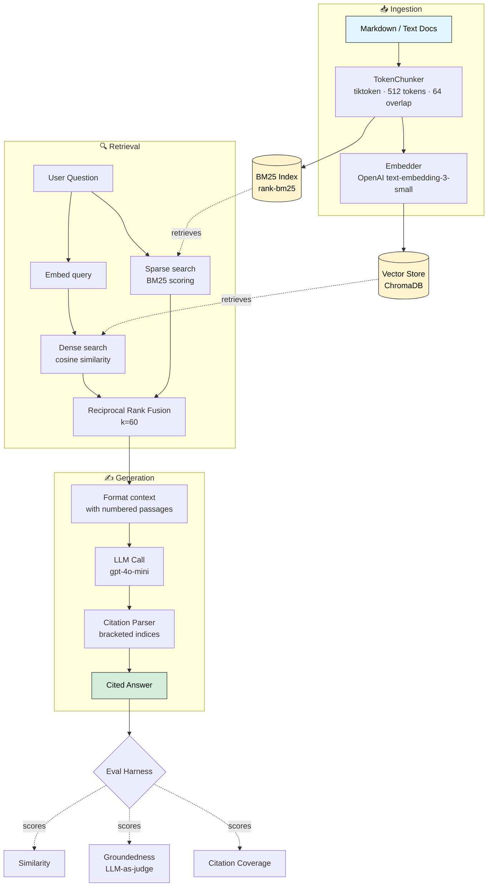
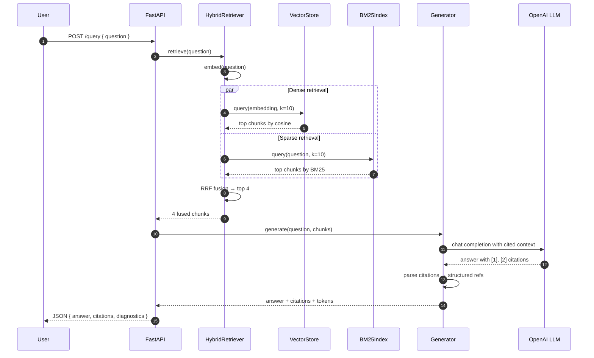

# Anchor

> Production-grade RAG with citation tracing and evaluation-first design.


## Architecture at a glance



## How a query flows through the system



## Why hybrid retrieval?

Dense embeddings catch semantic similarity but miss exact terms — acronyms, function names, error strings. BM25 catches those. Fusing both via RRF gives noticeably better recall on technical docs than either alone. Full rationale in [ADR-0001](./docs/decisions/0001-hybrid-retrieval.md).

| Query type | Dense-only wins | BM25-only wins | Hybrid wins |
|---|:---:|:---:|:---:|
| Paraphrased semantic | ✅ | ❌ | ✅ |
| Exact keyword / code identifier | ❌ | ✅ | ✅ |
| Mixed (concept + specific term) | ⚠️ | ⚠️ | ✅ |

Anchor is a retrieval-augmented generation system that answers questions from your documents and **cites the exact passages it used**. Every claim in the answer maps back to a source chunk; claims that can't be grounded trigger an explicit refusal rather than a hallucination.

The system is designed around three principles I wish more RAG implementations took seriously:

1. **Hybrid retrieval beats dense-only retrieval.** Embedding similarity misses acronyms, code identifiers, and exact-keyword queries. BM25 catches those. Fusing both via Reciprocal Rank Fusion is robust and parameter-free. ([ADR-0001](./docs/decisions/0001-hybrid-retrieval.md))
2. **Citations must be parseable and verifiable.** Inline `[1, 2]` references are easy for LLMs to emit reliably and easy to programmatically check. ([ADR-0002](./docs/decisions/0002-citation-format.md))
3. **Evaluation is part of the system, not an afterthought.** A built-in harness scores answers on similarity, groundedness, and citation coverage — so prompt changes ship with evidence, not vibes.

## What's in here

```
anchor/
├── src/anchor/
│   ├── api/           FastAPI service + Pydantic schemas
│   ├── ingestion/     token-aware chunking · batched embedding · pipeline
│   ├── retrieval/     ChromaDB vector store · BM25 index · hybrid fusion
│   ├── generation/    prompt templates · grounded generator · citation parser
│   ├── eval/          metrics · LLM-as-judge · harness
│   └── config.py      env-driven Pydantic settings
├── evals/
│   ├── cases/         JSON test cases
│   └── run.py         eval runner CLI
├── data/              sample documents (Python & FastAPI fundamentals)
├── tests/             pytest unit tests
├── scripts/           ingest.py · query.py CLIs
├── docs/decisions/    Architecture Decision Records
├── ARCHITECTURE.md    deep dive on system structure & data flow
└── Dockerfile         containerized deployment
```

## Quick start

### 1. Install

```bash
git clone https://github.com/Parths8104/anchor.git
cd anchor
python -m venv .venv
source .venv/bin/activate            # Windows: .venv\Scripts\activate
pip install -e ".[dev]"
```

### 2. Configure

```bash
cp .env.example .env
# Edit .env and set OPENAI_API_KEY=sk-...
```

### 3. Ingest sample documents

```bash
python scripts/ingest.py data/
```

You should see structured log output like:

```
[info] ingested_doc doc_id=python_basics-a1b2... chunks=4
[info] ingested_doc doc_id=fastapi_intro-c3d4... chunks=6
[info] ingestion_complete total_chunks=10
```

### 4. Ask a question from the CLI

```bash
python scripts/query.py "How does dependency injection work in FastAPI?"
```

Sample output:

```
========================================================================
QUESTION: How does dependency injection work in FastAPI?
========================================================================

ANSWER:
FastAPI provides dependency injection through the Depends() function [1].
You declare a parameter with Depends(callable) and FastAPI will call that
callable for each request, passing the result into your endpoint [1].
Dependencies can themselves declare further dependencies, forming a tree
that FastAPI resolves automatically [2]. Dependencies are cached per
request by default so the same callable isn't invoked twice in a single
request [2].

CITATIONS:
  [1] fastapi_intro-c3d4...::chunk-0002: FastAPI provides dependency...
  [2] fastapi_intro-c3d4...::chunk-0003: Dependencies can themselves...

DIAGNOSTICS:
  dense retrieved : 10
  bm25 retrieved  : 6
  chunks used     : 4
  prompt tokens   : 412
  completion tok. : 98
```

### 5. Or run it as a service

```bash
uvicorn anchor.api.main:app --reload
```

Then `POST` to `/query`:

```bash
curl -X POST http://localhost:8000/query \
  -H "Content-Type: application/json" \
  -d '{"question": "When should I use asyncio in Python?"}'
```

Interactive docs at `http://localhost:8000/docs`.

### 6. Run the eval harness

```bash
python evals/run.py
```

Output:

```
EVAL SUMMARY
============================================================
              cases : 3
             passed : 3
          pass_rate : 1.0
    mean_similarity : 0.87
      mean_coverage : 0.91
      grounded_rate : 1.0
    mean_latency_ms : 1843.2

Report: evals/reports/report-20260601T120000Z.json
```

## Running with Docker

```bash
docker build -t anchor .
docker run --rm -p 8000:8000 --env-file .env anchor
```

Or with `docker compose`:

```bash
docker compose up --build
```

## Running the tests

```bash
pytest tests/ -v
```

Includes unit tests for chunking, BM25, RRF fusion logic, and metrics. CI runs the test suite on Python 3.10, 3.11, and 3.12 via GitHub Actions ([workflow](./.github/workflows/ci.yml)).

## Architecture

See [ARCHITECTURE.md](./ARCHITECTURE.md) for the full diagram, module responsibilities, data flows for ingestion and query, and how failure modes are handled.

Key design decisions are recorded as ADRs:
- [ADR-0001 — Hybrid retrieval via Reciprocal Rank Fusion](./docs/decisions/0001-hybrid-retrieval.md)
- [ADR-0002 — Inline bracketed citations](./docs/decisions/0002-citation-format.md)

## What's deliberately not in v1

These are things a production deployment would want, sketched out in [ARCHITECTURE.md](./ARCHITECTURE.md) for the path forward:

- **Cross-encoder reranking** — the top-N fused results would benefit from a reranker pass before generation. Skipped here to keep dependencies light.
- **Semantic caching** — query embeddings hashed against an LRU cache to skip repeat work.
- **OpenTelemetry tracing** — per-stage spans with latency histograms.
- **Multi-tenant isolation** — `doc_id` prefixed with `tenant_id`, per-tenant Chroma collections.
- **Async batched ingestion** — large doc sets processed via background workers rather than blocking the API.

## License

MIT — see [LICENSE](./LICENSE).

## Author

Built by [Parth Sojitra](https://github.com/Parths8104). Reach me at psojitraswe@gmail.com or via [LinkedIn](https://www.linkedin.com/in/parth-sojitra-84098427b/).
